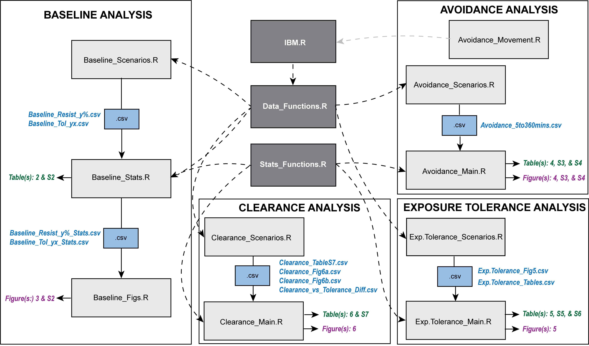

# resistance_and_tolerance

This repository is to create the analyses for the manuscript "Experimental and statistical decisions influence the accuracy and reliability of host resistance and tolerance measurements". 

See this figure for all of the necessary R scripts for each analyses and their corresponding outputs in terms of .csv files, figures and tables.

**Code Overview Figure:** Overview of the R scripts, their dependencies and their inputs and outputs for the four analyses: Baseline, Avoidance, Exposure Tolerance and Clearance. The grey boxes represent the main IBM and functions R scripts (dark grey) and the R scripts necessary to run each separate analysis (light grey). Dashed arrows represent the necessary coding dependencies for all analyses (black) or for an individual analysis (grey) while solid arrows indicate outputs including .csv files (blue boxes and text), tables (green text) and figures (purple text).

## BASELINE ANALYSES
**Main Coding Scripts:** Baseline_Scenarios.R, Baseline_Stats.R, Baseline_Figs.R 

**Data Files Produced (.csv):** 
- From Baseline_Scenarios.R
     - Baseline _Resist_y%.csv (10%, 25%, 75%)
     - Baseline _Tol_yx.csv (2x, 5x, 10x)	
- From Baseline_Stats.R
     - Baseline _Resist_y%_Stats.csv (10%, 25%, 75%)
     - Baseline _Tol_yx_Stats.csv (2x, 5x, 10x)
     
***Table(s): 2 & S2 (from Baseline_Stats.R)***

***Figure(s): 3 & S2 (from Baseline_Figs.R)***

**Summary:** Here we conduct simulations and statistical analyses to see how dosage of parasites, arena size, and exposure duration influence estimates of infection resistance and infection tolerance differences. Simulations of different exposure conditions are produced from Data_Functions.R and statistics from Poisson generalized linear models (for infection resistance differences) and Cox proportional hazards models (for infection tolerance differences) from Stats_Functions.R. To recreate statistics from Table 2 & S2 run Baseline_Stats.R and to recreate Figures 3 and S2, run Baseline_Figs.R. Please ensure you have downloaded all coding file dependencies outlined in the **Code Overview Figure**.

## AVOIDANCE ANALYSIS

**Main Coding Scripts:** Avoidance_Movement.R, Avoidance_Scenarios.R, Avoidance_Main.R

**Data Files Produced (.csv):**  
- From Avoidance_Scenarios.R
     - Avoidance_5to360mins.csv (Exposure durations: 5, 45, 135, 180, 360 ; and Arena sizes: 2x2 and 6x6)

***Table(s): 4, S3 and S4 (from Avoidance_Main.R)***

***Figures: 4 & S4 (from Avoidance_Main.R)***

**Summary:** Here we conduct simulations and statistical analyses to see how dosage of parasites, arena size, and exposure duration influence estimates of infection resistance differences when avoidance (behavioural resistance) is present. We also illustrate how differences in avoidance can be captured by using the remaining number of parasites following exposure. Simulations of different exposure conditions are produced from Data_Functions.R and statistics from Binomial linear models (for infection resistance and Avoidance differences) from Stats_Functions.R. To recreate statistics from Tables 4, S3 and S4 and Figures 4 and S4, run Avoidance_Main.R. Please ensure you have downloaded all coding file dependencies outlined in the **Code Overview Figure**. 

## EXPOSURE TOLERANCE ANALYSIS

**Main Coding Scripts:** Exp.Tolerance_Scenarios.R, Exp.Tolerance_Main.R

**Data Files Produced (.csv):** 
- From Exp.Tolerance_Scenarios.R
     - Exp.Tolerance_Fig5.csv 
     - Exp.Tolerance_Tables.csv
     
***Table(s): 5, S5 and S6 (from Exp.Tolerance_Main.R)***

***Figure(s): 5 (from Exp.Tolerance_Main.R)***

**Summary:** Here we conduct simulations and statistical analyses to see how the length of an experiment influence estimates of infection tolerance differences when exposure tolerance differences are present. Simulations of different experiment lengths and timing of sampling are produced from Data_Functions.R and statistics from Cox Proportional Hazards Models (for infection and exposure tolerance differences) from Stats_Functions.R. To recreate the statistics from the Tables 5, S5 and S6 and to reproduce Figure 5, run Exp.Tolerance_Main.R. Please ensure you have downloaded all coding file dependencies outlined in the **Code Overview Figure**. 

## CLEARANCE ANALYSIS

**Main Coding Scripts:** Clearance_Scenarios.R, Clearance_Main.R

**Data Files Produced (.csv):** 
- From Clearance_Scenarios.R
     - Clearance_TableS7.csv 
     - Clearance_Fig6a.csv
     - Clearance_Fig6b.csv
     - Clearance_vs_Tolerance_Diff.csv
     
***Table(s): 6 & S7 (from Clearance_Main.R)***

***Figure(s): 6 (from Clearance_Main.R)***

**Summary:** Here we conduct simulations and statistical analyses to see how timing of the first sampling and number of samples taken influence estimates of infection resistance differences when clearance differences are present. We also check whether clearance can confound infection tolerance differences. Simulations of different sampling times and events are produced from Data_Functions.R and statistics from Poisson GLMs (for infection resistance and clearance differences) and from Stats_Functions.R. Statistics from Cox Proportional Hazards Models to compare clearance and tolerance differences are also from Stats_Functions.R. To recreate statistics from Table 6 and S7 and Figure 6, run Clearance_Main.R. Please ensure you have downloaded all coding file dependencies outlined in the **Code Overview Figure**.

